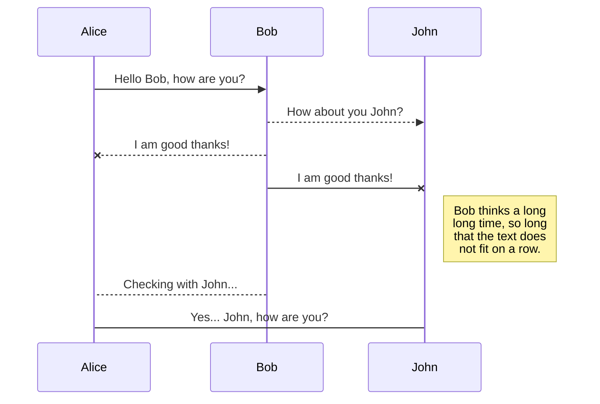
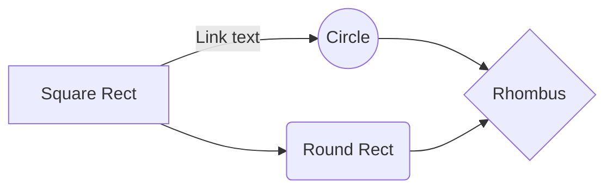

# Deployment

 1. Create openode.io new account, new instance
 2. Go to your local repo in cmd/terminal
 3. `npm install openode --g`
 4. `openode`
 5. Fill in user/password/server info.
 6. `openode template --with-services postgresql`
 7.  [openode postgresql local reference](https://blog.openode.io/b/adding-a-local-postgresql-database-82)
 8. In docker
 9. For a **CLEAN SLATE** `openode erase-all; openode deploy`
 10. To add files and reload `openode sync-n-reload`
`

**DO NOT** use `openode deploy`!!!

Postgresql will be running and the deploy can corrupt data. Insteaad, use `openode stop; openode deploy` or `openode sync-n-reload`

## SmartyPants

SmartyPants converts ASCII punctuation characters into "smart" typographic punctuation HTML entities. For example:

|                |ASCII                          |HTML                         |
|----------------|-------------------------------|-----------------------------|
|Single backticks|`'Isn't this fun?'`            |'Isn't this fun?'            |
|Quotes          |`"Isn't this fun?"`            |"Isn't this fun?"            |
|Dashes          |`-- is en-dash, --- is em-dash`|-- is en-dash, --- is em-dash|

## UML diagrams

You can render UML diagrams using [Mermaid](https://mermaidjs.github.io/). For example, this will produce a sequence diagram:

And this will produce a flow chart:

